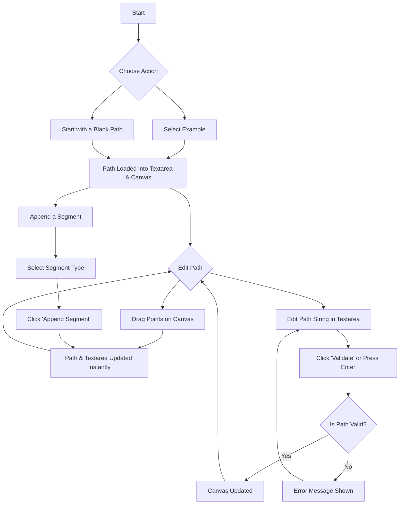
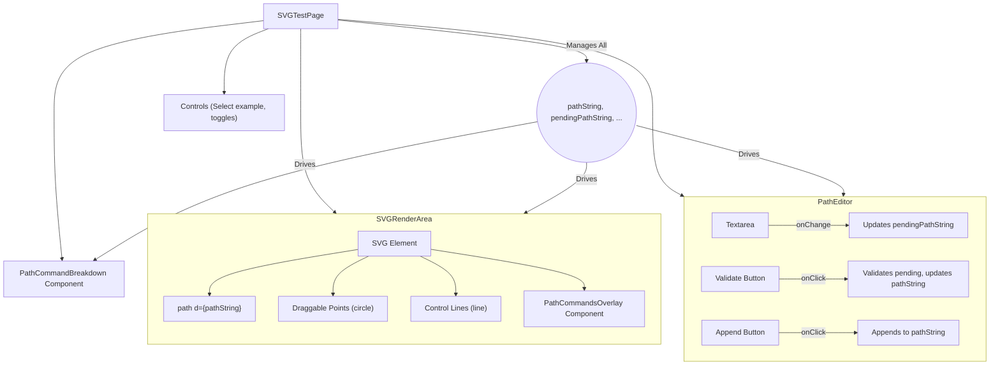
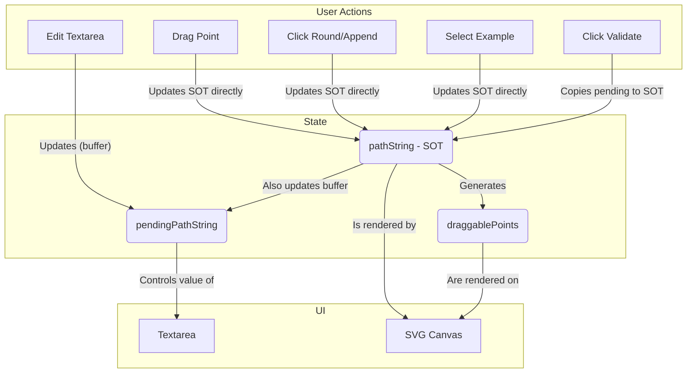
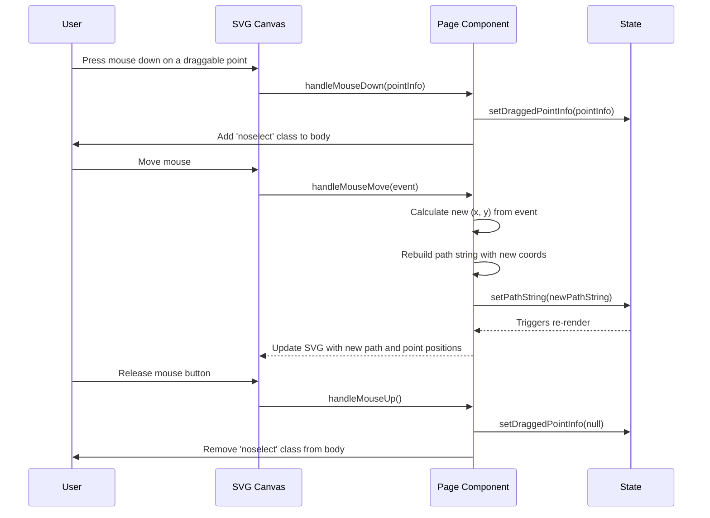

# SVG Path Visualizer

This is an interactive tool built with React and Next.js to help developers visualize, create, and debug SVG path data. It provides a real-time canvas where users can see their path rendered as they type or drag control points.

## ✨ Features

-   **Interactive Canvas**: A large SVG canvas with a coordinate grid and rulers.
-   **Live Path Editing**: Edit the raw SVG path string and see the changes reflected instantly after validation.
-   **Draggable Handles**: Manipulate the path visually by dragging endpoints and Bézier control points.
-   **Example Paths**: Load pre-defined examples for various curve types (`Q`, `C`, `A`, etc.).
-   **Append Segments**: Dynamically extend the current path with new segments of your choice.
-   **Path Breakdown**: See a detailed breakdown of each command in your path, with explanations.
-   **Command & Coordinate Overlays**: Visualize the command letters and coordinates directly on the canvas.
-   **Path Manipulation**: Utility buttons to round values to integers.

## 🌊 User Workflow

The visualizer supports a flexible workflow for creating and editing paths, whether you prefer coding or visual manipulation.

## 🏗️ Architecture Overview

The tool is built as a single, comprehensive React component (`SVGTestPage`) that manages its own state and renders several sub-components for different UI sections.

### Component Structure

The main page is composed of several logical blocks that handle rendering, controls, and information display.

### State Management: The Source of Truth

A key architectural decision is the separation of the rendered path from the path being edited in the textarea. This provides a stable user experience.

## ⚙️ Interaction Flow: Dragging a Point

This sequence diagram illustrates what happens under the hood when a user drags a point on the canvas.

